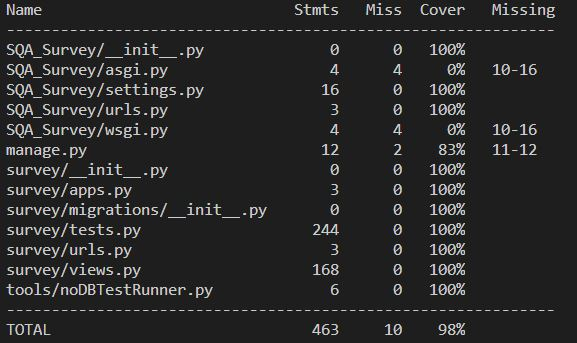

# Demonstrating Software Quality

Paul Paris - D19124166 - DT301A

## How to launch the application
As we are using Docker, it is easy to launch all you need is docker, you can find the installation details at the following links:
- [windows](https://hub.docker.com/editions/community/docker-ce-desktop-windows)
- [Debian](https://docs.docker.com/engine/install/debian/)
- [Ubuntu](https://docs.docker.com/engine/install/ubuntu/)
- [CentOS](https://docs.docker.com/engine/install/centos/)
- [Fedora](https://docs.docker.com/engine/install/fedora/)

Once you have downloaded and installed docker, the only thing left to to is launch the application using: `docker-compose up --build`

To run the tests use: `docker-compose run sqa-survey coverage run --source='.' manage.py test`.

And to get the coverage of the run tests use: `docker-compose run sqa-survey python -m coverage report -m`

> NOTE: you may need to add sudo depending on the destribution.

You can fin the endpoints documentation [here](./Documentation/REST_Route_Documentation.md) for the following routes:

- Create survey
- Get list survey
- Get one survey
- Create question
- Create survey responses
- Update survey response
- Get all survey response

---
## How to launch the application

The application development process is available on trello at this [link](https://trello.com/b/gbg22dpB/sqa-assignment).
 
To estimate the task hardness we use the Fibonacci-like scale (1, 2, 3, 5, 8, 13, 20, 40, 100).
How to estimate tasks ? you take the next 15-20 tasks, which you have to estimate for the upcoming sprints, and estimate each of the tasks relatively to the reference task.

---

## Unit testing and Test-Driven development
The project has been though and developed with test-driven developement in mind. Each code related commit have been done including the feature, its tests and its documentation.

This [link](https://github.com/ParisPaul/sqa-INFS3028-Final-Assignement/commit/523dd83746c417114cd310c01d99d95f221f475e) brings you to a commit to illustrate that. You can clearly see that the documentation file has had the route added to it, that tests have been made to test error management and the good working of the route and finaly the views.py where the intelligence of the route has been added.

---
## Test coverage metric
In order to evalute the test coverage of the code we have produced, I have decided to use 'coverage' a python dependence that does just that. Here is the installation [link](https://coverage.readthedocs.io/en/coverage-5.1/).

In the following image you can see that on views.py, where we have done our route intelligence, 100% of the code is covered, meaning all lines are executed during testing.

> For the asgi.py, wsgi.py and manage.py, these are django files, not files that I coded in.

---
## Code-review checklist

### Pull Request
- [ ] My code follows the style guidelines of this project
- [ ] I have performed a self-review of my own code
- [ ] I have commented my code
- [ ] I have updated documentation
- [ ] My tests are covering 100% of the newly added code
- [ ] New and existing unit tests pass with my changes

### Code Review
- [ ] Exception handling
- [ ] Code is in sync with existing code patterns/technologies
- [ ] Commented
- [ ] Use framework features
- [ ] Readability
- [ ] Testability
- [ ] Debugability
- [ ] Configurability
- [ ] Reusability
- [ ] Performance
- [ ] Scalability

